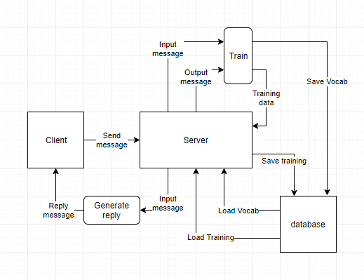

# Web Project

## Ideas

* Neural-net chatbot using brain.js
	* Type of page: "Web toy"
	* Target group: Techies

* Group activity planning dashboard.
	* Type of page: Utility web app
	* Target group: Students
	
* Online multiplayer game.
	* Type of page: Game
	* Target group: Gamers

## Planning

### Modules:
* [brain.js](https://github.com/BrainJS/brain.js)
* [file-system](https://www.npmjs.com/package/file-system)
* [socket.io](https://socket.io/)

### Diagram:

